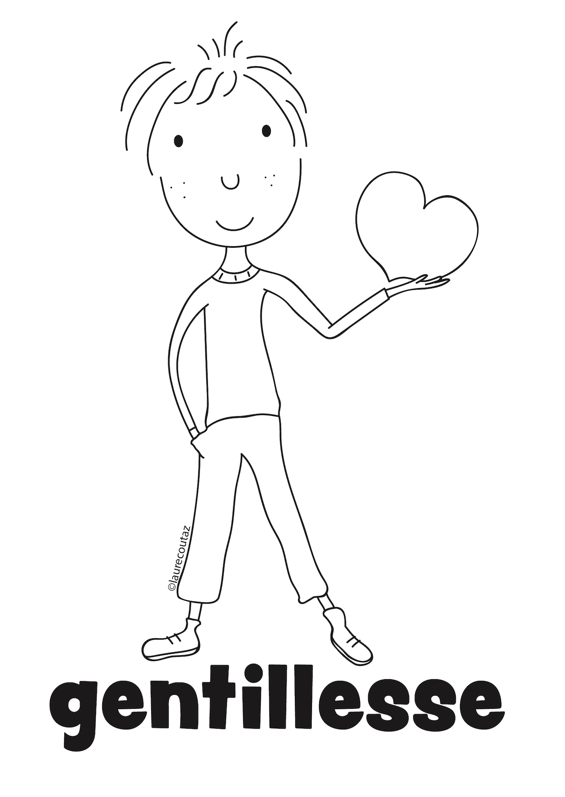
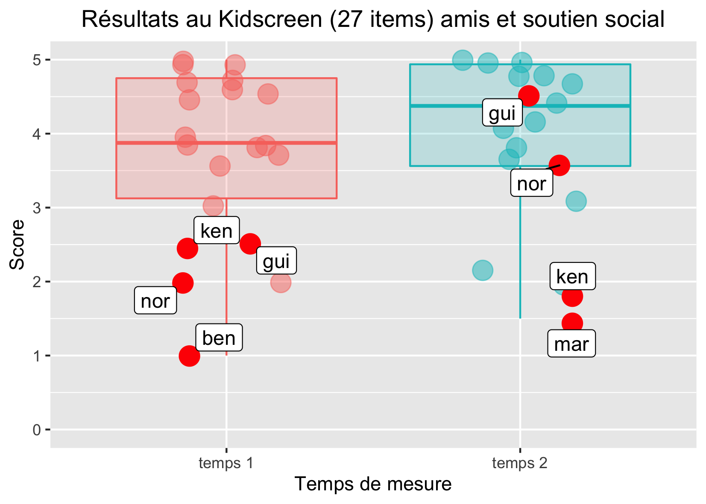

```{r setup, include=FALSE}
options(htmltools.dir.version = FALSE)
knitr::opts_chunk$set(
  fig.width=9, fig.height=3.5, fig.retina=3,
  out.width = "100%",
  cache = FALSE,
  echo = FALSE,
  message = FALSE, 
  warning = FALSE,
  fig.show = TRUE,
  hiline = TRUE
)
```

```{r xaringan-themer, include=FALSE, warning=FALSE}
library(xaringanthemer)
style_duo_accent(
  primary_color = "#D2202B",
  secondary_color = "#D2202B",
  inverse_header_color = "#FFFFFF",
  link_color = "#676C72",
    header_font_google = google_font("Josefin Sans")

)
```

class: hide_logo, middle
background-image: url(`r rmarkdown::metadata$url_ecpp`)
background-size: cover

# `r rmarkdown::metadata$title`

## `r rmarkdown::metadata$subtitle`

<!-- ### `r rmarkdown::metadata$date` `r rmarkdown::metadata$congress` -->

`r rmarkdown::metadata$author`, `r rmarkdown::metadata$coauthorship`

<p xmlns:cc="http://creativecommons.org/ns#" xmlns:dct="http://purl.org/dc/terms/"><a property="dct:title" rel="cc:attributionURL" href="https://bresnico.github.io/ecpp-2022-symposium-tessier-talk-bressoud/">Slides</a> by <a rel="cc:attributionURL dct:creator" property="cc:attributionName" href="https://nicolasbressoud.ch">Nicolas Bressoud</a> are licensed under <a href="http://creativecommons.org/licenses/by-nc/4.0/?ref=chooser-v1" target="_blank" rel="license noopener noreferrer" style="display:inline-block;">CC BY-NC 4.0</a></p>

---
class: left, hide_logo
background-image: url("img/background.png")
background-size: cover

### Strengths-based interventions in schools: A first trial in inclusive context with 11-12 y.o. children

```{r xaringan-logo, echo=FALSE}
library(xaringanExtra)

use_logo(
  image_url = "img/hep-vs-short.png",
  position = css_position(top = "31.5em", right = "9em")
)

use_progress_bar(color = "#d2202b", location = "top")

```

--

.pull-left[

```{r affiliation}
#| out.width: 50%

library(knitr)

folder <- "img/logos/"
logos <- c("logo-hepvs.png",
           "logo-ema.png",
           "logo-unifr.png",
           "logo-cheers.png",
           "logo-unidistance.png",
           "logo-lyon2.png")

path <- paste0(folder, logos)

include_graphics(path)
```


]

.pull-right[

<div class ="center">
```{r out.width = '80%', echo=FALSE}
# local


knitr::include_graphics("img/qrcode.png")
```

]

</div>

---
class: top
background-image: url("img/background.png")
background-size: cover


### Plan

--

1. Background

--

1. Le cas des forces de caractère

--

1. Dispositif prévu (matériel, coeur, N, etc)

--

1. Intervention (raconter)

--

1. Résultats (commenter)

--

1. Perspectives 

--

1. Montrer les premières images du matériel pour le POC...

--

1. Divers.

---
class: middle, title-slide, inverse
background-image: url("https://images.unsplash.com/photo-1469474968028-56623f02e42e?ixlib=rb-1.2.1&ixid=MnwxMjA3fDB8MHxwaG90by1wYWdlfHx8fGVufDB8fHx8&auto=format&fit=crop&w=2948&q=80")
background-size: cover

# Background

## Quels enjeux ?

## Quelles opportunités ?

---
class: top
background-image: url("img/background.png")
background-size: cover

### Background : enjeux

--

- école en Suisse : inclusion et hétérogénéité
- inclusion : enjeux
- hétérogénéité : enjeux
- comment fonctionner : opportunité pour la PP !!!!

Schools tend to be more and more inclusive. Thus, classrooms are often very heterogeneous: students have to live, learn and maybe even flourish with very diverse people.

clarifier le contexte CH

---
class: top
background-image: url("img/background.png")
background-size: cover

### Background : quelles Opportunités de la PP

--

- schémas IBE PGA et moi qui est déjà en anglais 
- schémas PGA et moi dans CSPS. en mettant en anglais

Studies suggest that the ability to create and maintain positive relationships between students plays one of the biggest roles in inclusive classrooms.


```{r out.width = '45%', echo=FALSE}
# local
knitr::include_graphics("img/bressoud_gay_2022.jpg")
```

[(Bressoud & Gay, 2022)](https://szh-shop.faros.ch/cms/Artikel-Detail/67565?itemID=REV2022_03)


---
class: middle, title-slide, inverse
background-image: url("https://images.unsplash.com/photo-1471286174890-9c112ffca5b4?ixlib=rb-1.2.1&ixid=MnwxMjA3fDB8MHxwaG90by1wYWdlfHx8fGVufDB8fHx8&auto=format&fit=crop&w=2338&q=80")
background-size: cover

# Développer une culture des forces

---

class: top
background-image: url("img/background.png")
background-size: cover

### Développer une culture des forces !

--

- définir.
- linkins et al.

In this context, strengths can be a very powerful vehicle to establish a greater sense of subjective well-being and enhance positive relationships. In this intervention, it is the teachers themselves who develop a strength-based culture in their classes with a particular activity. This study describes the effects of such an implementation.


- Forces de caractère [(Peterson & Seligman, 2004)](https://psycnet.apa.org/record/2004-13277-000)
- Utilisation des forces (identifier, utiliser, promouvoir) [(Linkins et al., 2015)](https://www.tandfonline.com/doi/abs/10.1080/17439760.2014.888581)


- Bénéfices pour les relations dans la classe [(Quinlan et al., 2014)](https://www.tandfonline.com/doi/abs/10.1080/17439760.2014.920407)
- Impact sur les affects positifs, le bien-être, la satisfaction de vie [(Schutte & Malouff, 2018)](https://link.springer.com/article/10.1007/s10902-018-9990-2)
- **Impact potentiel en contexte inclusif sur la qualité de vie, le besoin d'affiliation, le comportement prosocial,...)**

---

class: center
background-image: url("img/background.png")
background-size: cover

#### Développer une culture des forces

```{r out.width = '100%', echo=FALSE}
# local
knitr::include_graphics("img/9.png")
```
[(Bressoud et al., 2019)](https://orfee.hepl.ch/handle/20.500.12162/4159)

---
class: title-slide, middle, inverse
background-image: url("https://images.unsplash.com/photo-1523726491678-bf852e717f6a?ixlib=rb-1.2.1&ixid=MnwxMjA3fDB8MHxwaG90by1wYWdlfHx8fGVufDB8fHx8&auto=format&fit=crop&w=1740&q=80")
background-size: cover

# Dispositif


---
class: top
background-image: url("img/background.png")
background-size: cover

### Dispositif

--
raconter, montrer des images de ce qui est PREVU. Datas du contexte. Classe pilote. matériel.

Quelles variables DV et IV.

---
class: left
background-image: url("img/background.png")
background-size: cover

### Dispositif

.pull-left[
Une pédagogie en 5 étapes pour faire émerger et utiliser des **ressources personnelles** au sein du groupe [(Linkins et al., 2015)](https://www.tandfonline.com/doi/abs/10.1080/17439760.2014.888581) :

1. Connaître le vocabulaire des forces

1. Identifier les forces des autres

1. Identifier ses propres forces

1. Utiliser ses propres forces dans de nouveaux contextes

1. Identifier et célébrer les forces du groupe

]

.pull-right[

```{r out.width = '90%', echo=FALSE}
# local
knitr::include_graphics("img/1.jpg")
```

]

---
class: left
background-image: url("img/background.png")
background-size: cover

### Dispositif

.pull-left[
Une pédagogie en 5 étapes pour faire émerger et utiliser des **ressources personnelles** au sein du groupe [(Linkins et al., 2015)](https://www.tandfonline.com/doi/abs/10.1080/17439760.2014.888581) :

1. Connaître le vocabulaire des forces

1. Identifier les forces des autres

1. Identifier ses propres forces

1. Utiliser ses propres forces dans de nouveaux contextes

1. Identifier et célébrer les forces du groupe

]

.pull-right[

```{r out.width = '80%', echo=FALSE}
# local
knitr::include_graphics("img/2.jpg")
```

]

---
class: left
background-image: url("img/background.png")
background-size: cover

### Dispositif

.pull-left[
Une pédagogie en 5 étapes pour faire émerger et utiliser des **ressources personnelles** au sein du groupe [(Linkins et al., 2015)](https://www.tandfonline.com/doi/abs/10.1080/17439760.2014.888581) :

1. Connaître le vocabulaire des forces

1. Identifier les forces des autres

1. Identifier ses propres forces

1. Utiliser ses propres forces dans de nouveaux contextes

1. Identifier et célébrer les forces du groupe

]

.pull-right[

```{r out.width = '60%', echo=FALSE}
# local

```

]

---
class: left
background-image: url("img/background.png")
background-size: cover

### Dispositif

.pull-left[
Une pédagogie en 5 étapes pour faire émerger et utiliser des **ressources personnelles** au sein du groupe [(Linkins et al., 2015)](https://www.tandfonline.com/doi/abs/10.1080/17439760.2014.888581) :

1. Connaître le vocabulaire des forces

1. Identifier les forces des autres

1. Identifier ses propres forces

1. Utiliser ses propres forces dans de nouveaux contextes

1. Identifier et célébrer les forces du groupe

]

.pull-right[

```{r out.width = '60%', echo=FALSE}
# local

```

]

---
class: left
background-image: url("img/background.png")
background-size: cover

### Dispositif

.pull-left[
Une pédagogie en 5 étapes pour faire émerger et utiliser des **ressources personnelles** au sein du groupe [(Linkins et al., 2015)](https://www.tandfonline.com/doi/abs/10.1080/17439760.2014.888581) :

1. Connaître le vocabulaire des forces

1. Identifier les forces des autres

1. Identifier ses propres forces

1. Utiliser ses propres forces dans de nouveaux contextes

1. Identifier et célébrer les forces du groupe

]

.pull-right[

```{r out.width = '100%', echo=FALSE}
# local
knitr::include_graphics("img/5.jpg")
```

]

---
class: left
background-image: url("img/background.png")
background-size: cover

### Dispositif

.pull-left[
Une pédagogie en 5 étapes pour faire émerger et utiliser des **ressources personnelles** au sein du groupe [(Linkins et al., 2015)](https://www.tandfonline.com/doi/abs/10.1080/17439760.2014.888581) :

1. Connaître le vocabulaire des forces

1. Identifier les forces des autres

1. Identifier ses propres forces

1. Utiliser ses propres forces dans de nouveaux contextes

1. Identifier et célébrer les forces du groupe

]

.pull-right[

```{r out.width = '70%', echo=FALSE}
# local
knitr::include_graphics("img/6.jpg")
```

]

---

class: title-slide, middle, inverse
background-image: url("https://images.unsplash.com/photo-1555949963-ff9fe0c870eb?ixlib=rb-1.2.1&ixid=MnwxMjA3fDB8MHxwaG90by1wYWdlfHx8fGVufDB8fHx8&auto=format&fit=crop&w=2940&q=80")
background-size: cover

# Intervention

---
class: top
background-image: url("img/background.png")
background-size: cover

### Intervention

--

Method: Qualitative data were collected in a pilot class of 11 to 12-year-old Swiss students including a child on the autism spectrum. Students’ perceptions of peer relatedness were gathered via computerized open-ended questionnaires at the end of the intervention.

Montrer combien, comment, par qui, exemples de ce qui s'est passé.

---
class: title-slide, middle, inverse
background-image: url("https://images.unsplash.com/photo-1520004434532-668416a08753?ixlib=rb-1.2.1&ixid=MnwxMjA3fDB8MHxwaG90by1wYWdlfHx8fGVufDB8fHx8&auto=format&fit=crop&w=2940&q=80")
background-size: cover

# Results

---
class: top
background-image: url("img/background.png")
background-size: cover

### Results

--

Results highlight that the students were strongly satisfied with this strength-based intervention. This intervention helped children identify their peers through competences rather than weaknesses.
Thus, they felt that peer relationships were enhanced by strength activities.

plots

commenter.

---

class: left center
background-image: url("img/background.png")
background-size: cover

### Results

```{r out.width = '60%', echo=FALSE}
# local

```

---

class: left center
background-image: url("img/background.png")
background-size: cover

### Results

```{r out.width = '60%', echo=FALSE}
# local
knitr::include_graphics("img/8.png")
```


---
class: title-slide, middle, inverse
background-image: url("https://images.unsplash.com/photo-1446769357257-5aa1b1bfcd65?ixlib=rb-1.2.1&ixid=MnwxMjA3fDB8MHxwaG90by1wYWdlfHx8fGVufDB8fHx8&auto=format&fit=crop&w=2940&q=80")
background-size: cover

# Perspectives

## de manière générale
## le rôle des enseignants

---
class: top
background-image: url("img/background.png")
background-size: cover

### Perspectives

--

We will discuss perspectives on research and strength-based pedagogical activities. In inclusive classrooms, strengths interventions seem to play a crucial role in students’ positive relationships which is believed to have impacts on well-being, academic achievement, decrease of bullying.

Il faut être prudent mais les acteurs veulent qu'on continue.

Alors POC de Anais et Laetitia et montrer de images de comment on a donné du CORPS az programme pour booster les effets.

PEut-être sortir des données de Laetitia pour montrer qu'on doit aller plus loin ???

---
class:top
background-image: url("img/background.png")
background-size: cover

### Perspectives : le matériel ne suffit pas !

--

Formation des profs.

Prochain design ?

---
class: top
background-image: url("img/background.png")
background-size: cover

### Perspectives: towards a POC

---
class: title-slide, middle, inverse, hide-logo
background-image: url("https://images.unsplash.com/photo-1518623001395-125242310d0c?ixlib=rb-1.2.1&ixid=MnwxMjA3fDB8MHxwaG90by1wYWdlfHx8fGVufDB8fHx8&auto=format&fit=crop&w=2880&q=80")
background-size: cover

# Next steps

---
class: top
background-image: url("img/background.png")
background-size: cover

### Next steps

---

class: middle
background-image: url("img/background.png")
background-size: cover

.left[


## &#x1F64F; Merci !

]

--

.right[


Crédits Photo par ordre d'apparition :

[David Marcu](https://unsplash.com/photos/78A265wPiO4)

[Ben White](https://unsplash.com/photos/lVCHfXn3VME)

[Med Badr Chemmaoui](hhttps://unsplash.com/photos/ZSPBhokqDMc)

[Shahadat Rahman](https://unsplash.com/photos/BfrQnKBulYQ)

[Kelly Sikkema](https://unsplash.com/photos/4JxV3Gs42Ks)

<!-- [Mats Hagwall](https://unsplash.com/photos/uzl47XdoLww) -->

[Justin Luebke](https://unsplash.com/photos/BkkVcWUgwEk)

[Vidar Nordli-Mathisen](https://unsplash.com/photos/Kuu5mmxkwW4)

[Towfiqu barbhuiya](https://unsplash.com/photos/oZuBNC-6E2s)

]

---
class: title-slide, middle, inverse
background-image: url("https://images.unsplash.com/photo-1633613286848-e6f43bbafb8d?ixlib=rb-1.2.1&ixid=MnwxMjA3fDB8MHxwaG90by1wYWdlfHx8fGVufDB8fHx8&auto=format&fit=crop&w=2940&q=80")
background-size: cover

# Questions ?

### Nicolas Bressoud 

### Valais University of teacher education &#x1F1E8;&#x1F1ED;
### nicolas.bressoud@hepvs.ch
