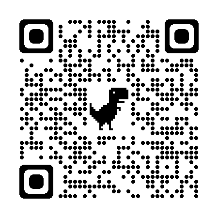
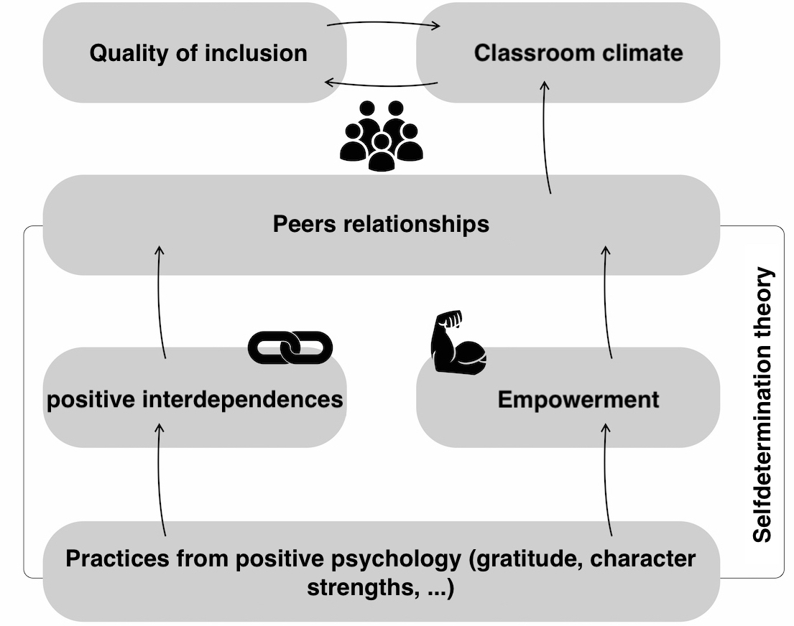
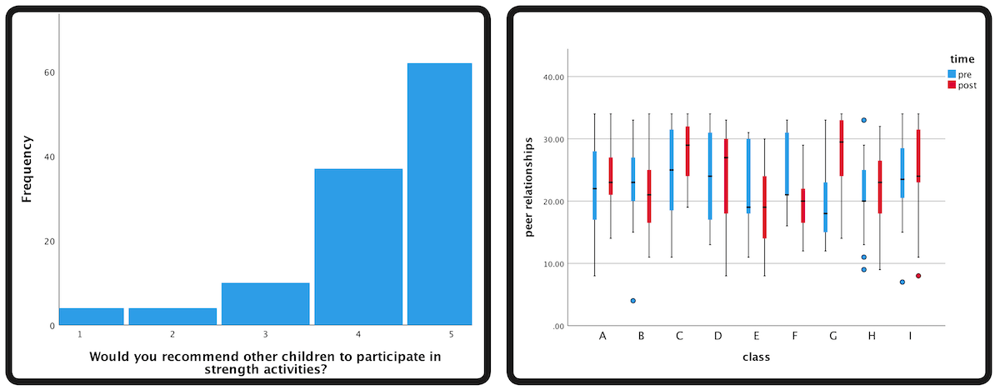
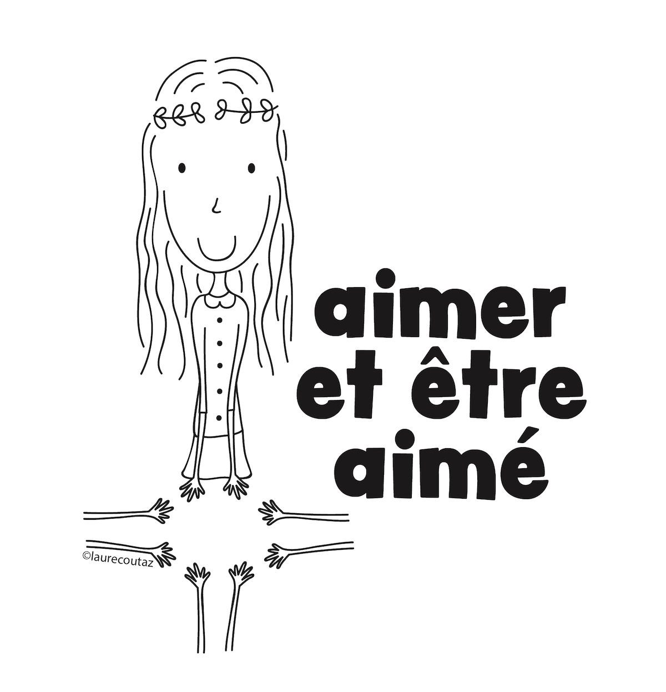
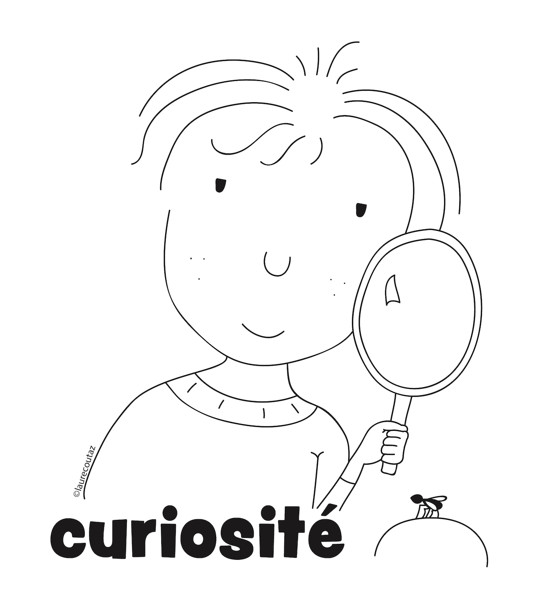
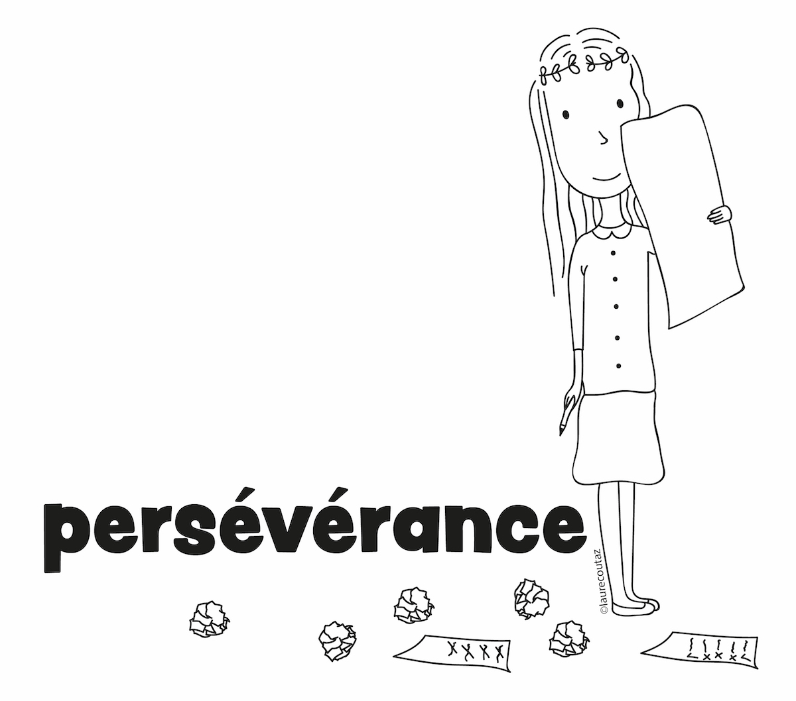
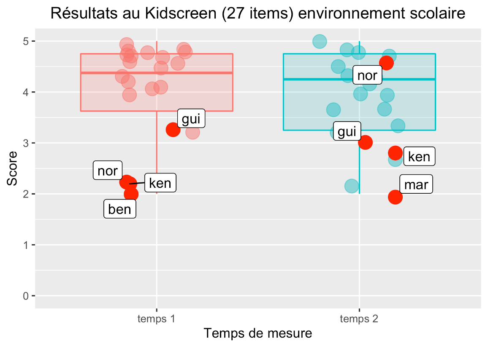

```{r setup, include=FALSE}
options(htmltools.dir.version = FALSE)
knitr::opts_chunk$set(
  fig.width=9, fig.height=3.5, fig.retina=3,
  out.width = "100%",
  cache = FALSE,
  echo = FALSE,
  message = FALSE, 
  warning = FALSE,
  fig.show = TRUE,
  hiline = TRUE
)
```

```{r xaringan-themer, include=FALSE, warning=FALSE}
library(xaringanthemer)
style_duo_accent(
  primary_color = "#D2202B",
  secondary_color = "#D2202B",
  inverse_header_color = "#FFFFFF",
  link_color = "#676C72",
    header_font_google = google_font("Josefin Sans")

)
```

class: hide_logo, middle
background-image: url(`r rmarkdown::metadata$url_ecpp`)
background-size: cover

# `r rmarkdown::metadata$title`

## `r rmarkdown::metadata$subtitle`

<!-- ### `r rmarkdown::metadata$date` `r rmarkdown::metadata$congress` -->

`r rmarkdown::metadata$author`, `r rmarkdown::metadata$coauthorship`

<p xmlns:cc="http://creativecommons.org/ns#" xmlns:dct="http://purl.org/dc/terms/"><a property="dct:title" rel="cc:attributionURL" href="https://bresnico.github.io/ecpp-2022-symposium-tessier-talk-bressoud/">Slides</a> by <a rel="cc:attributionURL dct:creator" property="cc:attributionName" href="https://nicolasbressoud.ch">Nicolas Bressoud</a> are licensed under <a href="http://creativecommons.org/licenses/by-nc/4.0/?ref=chooser-v1" target="_blank" rel="license noopener noreferrer" style="display:inline-block;">CC BY-NC 4.0</a></p>

---
class: left, hide_logo
background-image: url("img/background.png")
background-size: cover

### Strengths-based interventions in schools:
### A first trial in inclusive context with 11-12 y.o. children

```{r xaringan-logo, echo=FALSE}
library(xaringanExtra)

use_logo(
  image_url = "img/hep-vs-short.png",
  position = css_position(top = "31.5em", right = "9em")
)

use_progress_bar(color = "#d2202b", location = "top")

```

--

.pull-left[

```{r affiliation}
#| out.width: 40%

library(knitr)

folder <- "img/logos/"
logos <- c("logo-hepvs.png",
           "logo-ema.png",
           "logo-unifr_crop.png",
           "logo-cheers.png",
           "logo-hepl.png",
           "logo-unidistance.png",
           "logo-lyon2.png")

path <- paste0(folder, logos)

include_graphics(path)
```


]

.pull-right[

<div class ="center">
```{r out.width = '80%', echo=FALSE}
# local



```

]

</div>

---
class: top
background-image: url("img/background.png")
background-size: cover


### Plan

--

1. Background

--

1. The case of character strengths

--

1. Teaching device

--

1. Intervention

--

1. Results

--

1. Prospects 

--

1. Next steps

---
class: middle, title-slide, inverse
background-image: url("https://images.unsplash.com/photo-1469474968028-56623f02e42e?ixlib=rb-1.2.1&ixid=MnwxMjA3fDB8MHxwaG90by1wYWdlfHx8fGVufDB8fHx8&auto=format&fit=crop&w=2948&q=80")
background-size: cover

# Background

### Challenges

### Opportunities

---
class: top
background-image: url("img/background.png")
background-size: cover

### Background
### Challenges

--

Schools in Switzerland :

- 26 educational systems

- Inclusive policies (special needs)

*"Integrative solutions are preferred over segregated solutions, while respecting the well-being and developmental potential of the child or youth concerned and taking into account the school environment and organization."*
---
class: top
background-image: url("img/background.png")
background-size: cover

### Background
### Opportunities

--

<div class="center">

```{r out.width = '45%', echo=FALSE}
# local

```

</div>

[(Bressoud & Gay, 2022)](https://szh-shop.faros.ch/cms/Artikel-Detail/67565?itemID=REV2022_03)


---
class: middle, title-slide, inverse
background-image: url("https://images.unsplash.com/photo-1471286174890-9c112ffca5b4?ixlib=rb-1.2.1&ixid=MnwxMjA3fDB8MHxwaG90by1wYWdlfHx8fGVufDB8fHx8&auto=format&fit=crop&w=2338&q=80")
background-size: cover

# Develop a culture of character strengths

---

class: top
background-image: url("img/background.png")
background-size: cover

### Develop a culture of character strengths

--


- Character strengths [(Peterson & Seligman, 2004)](https://psycnet.apa.org/record/2004-13277-000)

- Use of strengths [(Linkins et al., 2015)](https://www.tandfonline.com/doi/abs/10.1080/17439760.2014.888581)


- Benefits in the classroom [(Quinlan et al., 2014)](https://www.tandfonline.com/doi/abs/10.1080/17439760.2014.920407)

- Impact on positive affects, WB, satisfaction of life [(Schutte & Malouff, 2018)](https://link.springer.com/article/10.1007/s10902-018-9990-2)

- **Potential impact in inclusive settings on quality of life, affiliation needs, prosocial behaviour,...)**

---

class: top
background-image: url("img/background.png")
background-size: cover

### Develop a culture of character strengths

<div class="center">

```{r out.width = '80%', echo=FALSE}
# local

```

</div>

[(Bressoud et al., 2019)](https://orfee.hepl.ch/handle/20.500.12162/4159)

---
class: title-slide, middle, inverse
background-image: url("https://images.unsplash.com/photo-1523726491678-bf852e717f6a?ixlib=rb-1.2.1&ixid=MnwxMjA3fDB8MHxwaG90by1wYWdlfHx8fGVufDB8fHx8&auto=format&fit=crop&w=1740&q=80")
background-size: cover

# Teaching Device

---
class: left
background-image: url("img/background.png")
background-size: cover

### Teaching Device

--

.pull-left[
Based on the following five steps proposed by  [Linkins et al. (2015)](https://www.tandfonline.com/doi/abs/10.1080/17439760.2014.888581) :

1. Developing a character strengths language

1. Recognizing and thinking about strengths in others

1. Recognizing and thinking about one’s own strengths

1. Practicing and applying strengths

1. Identifying, celebrating, and cultivating group strengths

]

.pull-right[

```{r out.width = '90%', echo=FALSE}
# local

```

]

---
class: left
background-image: url("img/background.png")
background-size: cover

### Teaching Device

.pull-left[
Based on the following five steps proposed by  [Linkins et al. (2015)](https://www.tandfonline.com/doi/abs/10.1080/17439760.2014.888581) :

1. Developing a character strengths language

1. Recognizing and thinking about strengths in others

1. Recognizing and thinking about one’s own strengths

1. Practicing and applying strengths

1. Identifying, celebrating, and cultivating group strengths

]
.pull-right[

```{r out.width = '80%', echo=FALSE}
# local

```

]

---
class: left
background-image: url("img/background.png")
background-size: cover

### Teaching Device

.pull-left[
Based on the following five steps proposed by  [Linkins et al. (2015)](https://www.tandfonline.com/doi/abs/10.1080/17439760.2014.888581) :

1. Developing a character strengths language

1. Recognizing and thinking about strengths in others

1. Recognizing and thinking about one’s own strengths

1. Practicing and applying strengths

1. Identifying, celebrating, and cultivating group strengths

]

.pull-right[

```{r out.width = '60%', echo=FALSE}
# local
knitr::include_graphics("img/dispo-3.jpg")
```

]

---
class: left
background-image: url("img/background.png")
background-size: cover

### Teaching Device

.pull-left[
Based on the following five steps proposed by  [Linkins et al. (2015)](https://www.tandfonline.com/doi/abs/10.1080/17439760.2014.888581) :

1. Developing a character strengths language

1. Recognizing and thinking about strengths in others

1. Recognizing and thinking about one’s own strengths

1. Practicing and applying strengths

1. Identifying, celebrating, and cultivating group strengths

]

.pull-right[

```{r out.width = '60%', echo=FALSE}
# local
knitr::include_graphics("img/dispo-4.jpg")
```

]

---
class: left
background-image: url("img/background.png")
background-size: cover

### Teaching Device

.pull-left[
Based on the following five steps proposed by  [Linkins et al. (2015)](https://www.tandfonline.com/doi/abs/10.1080/17439760.2014.888581) :

1. Developing a character strengths language

1. Recognizing and thinking about strengths in others

1. Recognizing and thinking about one’s own strengths

1. Practicing and applying strengths

1. Identifying, celebrating, and cultivating group strengths

]

.pull-right[

```{r out.width = '100%', echo=FALSE}
# local

```

]

---
class: left
background-image: url("img/background.png")
background-size: cover

### Teaching Device

.pull-left[
Based on the following five steps proposed by  [Linkins et al. (2015)](https://www.tandfonline.com/doi/abs/10.1080/17439760.2014.888581) :

1. Developing a character strengths language

1. Recognizing and thinking about strengths in others

1. Recognizing and thinking about one’s own strengths

1. Practicing and applying strengths

1. Identifying, celebrating, and cultivating group strengths

]

.pull-right[

```{r out.width = '70%', echo=FALSE}
# local
knitr::include_graphics("img/dispo-6.jpg")
```

]

---

class: title-slide, middle, inverse
background-image: url("https://images.unsplash.com/photo-1555949963-ff9fe0c870eb?ixlib=rb-1.2.1&ixid=MnwxMjA3fDB8MHxwaG90by1wYWdlfHx8fGVufDB8fHx8&auto=format&fit=crop&w=2940&q=80")
background-size: cover

# Intervention

---
class: top
background-image: url("img/background.png")
background-size: cover

### Intervention

--

- Year 2016-2017

- 10-12 y.o. children

- 24 pupils (12 &#9792;)

- Special needs : ASD, child psychiatric intervention, psychological care, high potential

- T1 (october 2016) and T2 (april 2017) completed by 14 children

- semi-experimental method
    - IV : time effect
    - DV : psychological WB, Social support, school environment

---
class: title-slide, middle, inverse
background-image: url("https://images.unsplash.com/photo-1520004434532-668416a08753?ixlib=rb-1.2.1&ixid=MnwxMjA3fDB8MHxwaG90by1wYWdlfHx8fGVufDB8fHx8&auto=format&fit=crop&w=2940&q=80")
background-size: cover

# Results

---

class: left center
background-image: url("img/background.png")
background-size: cover

### Results
### Social support

```{r out.width = '50%', echo=FALSE}
# local
knitr::include_graphics("img/results-1.png")
```

---

class: left center
background-image: url("img/background.png")
background-size: cover

### Results
### psychological WB

```{r out.width = '50%', echo=FALSE}
# local
knitr::include_graphics("img/results-2.png")
```

---

class: left center
background-image: url("img/background.png")
background-size: cover

### Results
### School environment

```{r out.width = '50%', echo=FALSE}
# local

```

---

class: top
background-image: url("img/background.png")
background-size: cover

### Results

--

- MAR:
    - "I found it excellent"
    
    - "I felt much better."
    
    - "I had never thought about some of my strengths"
    
    - "I think I get along better with others
    
    - "Strengths use allows people to come together and protect each other."

--

- KEN:
    - "it serves to show that we all have something good"
    
    - " happiness is an illusion "

---

class: top
background-image: url("img/background.png")
background-size: cover

### Results

--

- GUI:
    - "We realize that we all have strengths and no one is bad"
    
    - "To get along well, I understand the importance of not making fun of each other."

--

- NOR:
    - "We learned to see that we are all different"
    
    - "I felt happy doing this"
    
    - "It improves the climate a little bit."

---
class: title-slide, middle, inverse
background-image: url("https://images.unsplash.com/photo-1446769357257-5aa1b1bfcd65?ixlib=rb-1.2.1&ixid=MnwxMjA3fDB8MHxwaG90by1wYWdlfHx8fGVufDB8fHx8&auto=format&fit=crop&w=2940&q=80")
background-size: cover

# What we learned and where we go

### General
### Towards a feasibility study (POC)
### The role of teachers

---
class: top
background-image: url("img/background.png")
background-size: cover

### Perspectives
### General

--

- Longer sequence

- Integrate into the life of the classroom

- Provide opportunities for adaptation by teachers

- Provide a framework

- Train our attentional mechanisms

---
class: top
background-image: url("img/background.png")
background-size: cover

### Perspectives
### Towards a proof of concept

--

.pull-left[
An activity box contains :
- 1 game board with 20 squares

- 1 poster of the 24 forces

- 30 challenge cards

- 24 force cards

- 1 folder of supplementary materials

- 1 teacher's guide
]

.pull-right[

<div class ="center">
```{r out.width="90%"}
include_graphics(path = "img/perspectives-1.png")
```
</div>

]

---
class:top
background-image: url("img/background.png")
background-size: cover

### Perspectives
### The role of teachers

--

- Teachers' beliefs and practices have an impact on students and their learning

- Teachers' conceptions of intelligence affect student achievement

- Job design is central to instructional effectiveness

- Methods are not inherently effective

e.g., [Hattie (2009)](https://www.researchgate.net/publication/270585193_Visible_Learning_A_Synthesis_of_Over_800_Meta-Analyses_Relating_to_Achievement), [Bressoux (2001)](https://www.researchgate.net/publication/267747865_Reflexions_sur_l'effet-maitre_et_l'etude_des_pratiques_enseignantes), [Elmore (1997)](https://files.eric.ed.gov/fulltext/ED429264.pdf)

---
class: title-slide, middle, inverse, hide-logo
background-image: url("https://images.unsplash.com/photo-1518623001395-125242310d0c?ixlib=rb-1.2.1&ixid=MnwxMjA3fDB8MHxwaG90by1wYWdlfHx8fGVufDB8fHx8&auto=format&fit=crop&w=2880&q=80")
background-size: cover

# Next steps

---
class: middle
background-image: url("img/background.png")
background-size: cover

### Next steps

- September 2022

- Control group : 4-6 classes

- Experimental group (teacher training and teaching tools) : 4-6 classes

- 10-12 lessons over 3 months

---

class: middle
background-image: url("img/background.png")
background-size: cover

.left[


## &#x1F64F; Þakka þér fyrir !

]

--

.right[


Crédits Photo par ordre d'apparition :

[David Marcu](https://unsplash.com/photos/78A265wPiO4)

[Ben White](https://unsplash.com/photos/lVCHfXn3VME)

[Med Badr Chemmaoui](hhttps://unsplash.com/photos/ZSPBhokqDMc)

[Shahadat Rahman](https://unsplash.com/photos/BfrQnKBulYQ)

[Kelly Sikkema](https://unsplash.com/photos/4JxV3Gs42Ks)

<!-- [Mats Hagwall](https://unsplash.com/photos/uzl47XdoLww) -->

[Justin Luebke](https://unsplash.com/photos/BkkVcWUgwEk)

[Vidar Nordli-Mathisen](https://unsplash.com/photos/Kuu5mmxkwW4)

[Towfiqu barbhuiya](https://unsplash.com/photos/oZuBNC-6E2s)

]

---
class: title-slide, middle, inverse
background-image: url("https://images.unsplash.com/photo-1633613286848-e6f43bbafb8d?ixlib=rb-1.2.1&ixid=MnwxMjA3fDB8MHxwaG90by1wYWdlfHx8fGVufDB8fHx8&auto=format&fit=crop&w=2940&q=80")
background-size: cover

# Questions ?

### Nicolas Bressoud 

### Valais University of teacher education &#x1F1E8;&#x1F1ED;
### nicolas.bressoud@hepvs.ch
