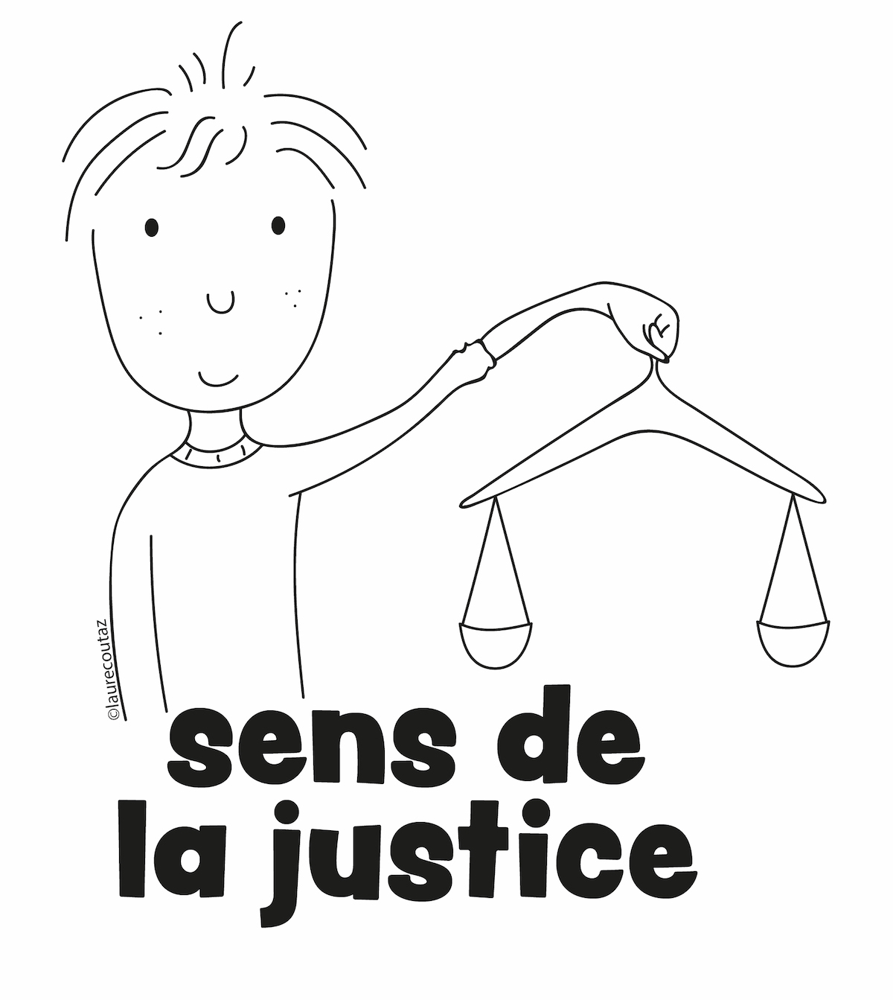
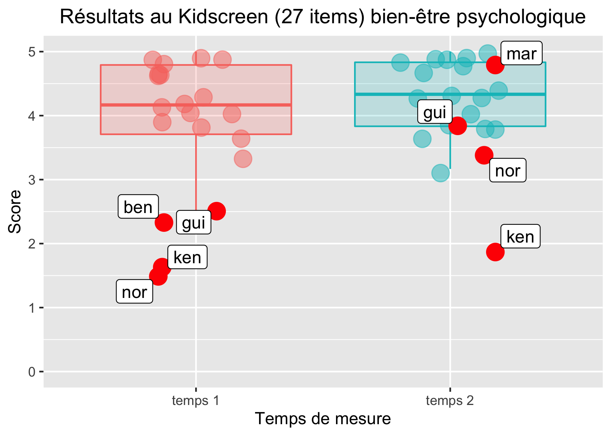

```{r setup, include=FALSE}
options(htmltools.dir.version = FALSE)
knitr::opts_chunk$set(
  fig.width=9, fig.height=3.5, fig.retina=3,
  out.width = "100%",
  cache = FALSE,
  echo = FALSE,
  message = FALSE, 
  warning = FALSE,
  fig.show = TRUE,
  hiline = TRUE
)
```

```{r xaringan-themer, include=FALSE, warning=FALSE}
library(xaringanthemer)
style_duo_accent(
  primary_color = "#D2202B",
  secondary_color = "#D2202B",
  inverse_header_color = "#FFFFFF",
  link_color = "#676C72",
    header_font_google = google_font("Josefin Sans")

)
```

class: hide_logo, middle
background-image: url(`r rmarkdown::metadata$url_ecpp`)
background-size: cover

# `r rmarkdown::metadata$title`

## `r rmarkdown::metadata$subtitle`

<!-- ### `r rmarkdown::metadata$date` `r rmarkdown::metadata$congress` -->

`r rmarkdown::metadata$author`, `r rmarkdown::metadata$coauthorship`

<p xmlns:cc="http://creativecommons.org/ns#" xmlns:dct="http://purl.org/dc/terms/"><a property="dct:title" rel="cc:attributionURL" href="https://bresnico.github.io/ecpp-2022-symposium-tessier-talk-bressoud/">Slides</a> by <a rel="cc:attributionURL dct:creator" property="cc:attributionName" href="https://nicolasbressoud.ch">Nicolas Bressoud</a> are licensed under <a href="http://creativecommons.org/licenses/by-nc/4.0/?ref=chooser-v1" target="_blank" rel="license noopener noreferrer" style="display:inline-block;">CC BY-NC 4.0</a></p>

---
class: left, hide_logo
background-image: url("img/background.png")
background-size: cover

### Strengths-based interventions in schools:
### A first trial in inclusive context with 11-12 y.o. children

```{r xaringan-logo, echo=FALSE}
library(xaringanExtra)

use_logo(
  image_url = "img/hep-vs-short.png",
  position = css_position(top = "31.5em", right = "9em")
)

use_progress_bar(color = "#d2202b", location = "top")

```

--

.pull-left[

```{r affiliation}
#| out.width: 45%

library(knitr)

folder <- "img/logos/"
logos <- c("logo-hepvs.png",
           "logo-ema.png",
           "logo-unifr.png",
           "logo-cheers.png",
           "logo-unidistance.png",
           "logo-lyon2.png")

path <- paste0(folder, logos)

include_graphics(path)
```


]

.pull-right[

<div class ="center">
```{r out.width = '80%', echo=FALSE}
# local


```

]

</div>

---
class: top
background-image: url("img/background.png")
background-size: cover


### Plan

--

1. Background

--

1. The case of character strengths

--

1. Teaching device

--

1. Intervention

--

1. Results

--

1. Prospects 

--

1. Next steps

---
class: middle, title-slide, inverse
background-image: url("https://images.unsplash.com/photo-1469474968028-56623f02e42e?ixlib=rb-1.2.1&ixid=MnwxMjA3fDB8MHxwaG90by1wYWdlfHx8fGVufDB8fHx8&auto=format&fit=crop&w=2948&q=80")
background-size: cover

# Background

### Challenges

### Opportunities

---
class: top
background-image: url("img/background.png")
background-size: cover

### Background
### Challenges

--

- école en Suisse : inclusion et hétérogénéité
- inclusion : enjeux
- hétérogénéité : enjeux
- comment fonctionner : opportunité pour la PP !!!!

Schools tend to be more and more inclusive. Thus, classrooms are often very heterogeneous: students have to live, learn and maybe even flourish with very diverse people.

clarifier le contexte CH

---
class: top
background-image: url("img/background.png")
background-size: cover

### Background
### Opportunities

--

<div class="center">

```{r out.width = '35%', echo=FALSE}
# local
knitr::include_graphics("img/background-1.jpg")
```

</div>

[(Bressoud & Gay, 2022)](https://szh-shop.faros.ch/cms/Artikel-Detail/67565?itemID=REV2022_03)


---
class: middle, title-slide, inverse
background-image: url("https://images.unsplash.com/photo-1471286174890-9c112ffca5b4?ixlib=rb-1.2.1&ixid=MnwxMjA3fDB8MHxwaG90by1wYWdlfHx8fGVufDB8fHx8&auto=format&fit=crop&w=2338&q=80")
background-size: cover

# Develop a culture of character strengths

---

class: top
background-image: url("img/background.png")
background-size: cover

### Develop a culture of character strengths

--

- définir.
- linkins et al.

In this context, strengths can be a very powerful vehicle to establish a greater sense of subjective well-being and enhance positive relationships. In this intervention, it is the teachers themselves who develop a strength-based culture in their classes with a particular activity. This study describes the effects of such an implementation.


- Forces de caractère [(Peterson & Seligman, 2004)](https://psycnet.apa.org/record/2004-13277-000)
- Utilisation des forces (identifier, utiliser, promouvoir) [(Linkins et al., 2015)](https://www.tandfonline.com/doi/abs/10.1080/17439760.2014.888581)


- Bénéfices pour les relations dans la classe [(Quinlan et al., 2014)](https://www.tandfonline.com/doi/abs/10.1080/17439760.2014.920407)
- Impact sur les affects positifs, le bien-être, la satisfaction de vie [(Schutte & Malouff, 2018)](https://link.springer.com/article/10.1007/s10902-018-9990-2)
- **Impact potentiel en contexte inclusif sur la qualité de vie, le besoin d'affiliation, le comportement prosocial,...)**

---

class: top
background-image: url("img/background.png")
background-size: cover

### Develop a culture of character strengths

<div class="center">

```{r out.width = '80%', echo=FALSE}
# local
knitr::include_graphics("img/forces-1.png")
```

</div>

[(Bressoud et al., 2019)](https://orfee.hepl.ch/handle/20.500.12162/4159)

---
class: title-slide, middle, inverse
background-image: url("https://images.unsplash.com/photo-1523726491678-bf852e717f6a?ixlib=rb-1.2.1&ixid=MnwxMjA3fDB8MHxwaG90by1wYWdlfHx8fGVufDB8fHx8&auto=format&fit=crop&w=1740&q=80")
background-size: cover

# Teaching Device

---
class: left
background-image: url("img/background.png")
background-size: cover

### Teaching Device

--

.pull-left[
Based on the following five steps proposed by  [Linkins et al. (2015)](https://www.tandfonline.com/doi/abs/10.1080/17439760.2014.888581) :

1. Developing a character strengths language

1. Recognizing and thinking about strengths in others

1. Recognizing and thinking about one’s own strengths

1. Practicing and applying strengths

1. Identifying, celebrating, and cultivating group strengths

]

.pull-right[

```{r out.width = '90%', echo=FALSE}
# local
knitr::include_graphics("img/dispo-1.jpg")
```

]

---
class: left
background-image: url("img/background.png")
background-size: cover

### Teaching Device

.pull-left[
Based on the following five steps proposed by  [Linkins et al. (2015)](https://www.tandfonline.com/doi/abs/10.1080/17439760.2014.888581) :

1. Developing a character strengths language

1. Recognizing and thinking about strengths in others

1. Recognizing and thinking about one’s own strengths

1. Practicing and applying strengths

1. Identifying, celebrating, and cultivating group strengths

]
.pull-right[

```{r out.width = '80%', echo=FALSE}
# local
knitr::include_graphics("img/dispo-2.jpg")
```

]

---
class: left
background-image: url("img/background.png")
background-size: cover

### Teaching Device

.pull-left[
Based on the following five steps proposed by  [Linkins et al. (2015)](https://www.tandfonline.com/doi/abs/10.1080/17439760.2014.888581) :

1. Developing a character strengths language

1. Recognizing and thinking about strengths in others

1. Recognizing and thinking about one’s own strengths

1. Practicing and applying strengths

1. Identifying, celebrating, and cultivating group strengths

]

.pull-right[

```{r out.width = '60%', echo=FALSE}
# local
knitr::include_graphics("img/dispo-3.jpg")
```

]

---
class: left
background-image: url("img/background.png")
background-size: cover

### Teaching Device

.pull-left[
Based on the following five steps proposed by  [Linkins et al. (2015)](https://www.tandfonline.com/doi/abs/10.1080/17439760.2014.888581) :

1. Developing a character strengths language

1. Recognizing and thinking about strengths in others

1. Recognizing and thinking about one’s own strengths

1. Practicing and applying strengths

1. Identifying, celebrating, and cultivating group strengths

]

.pull-right[

```{r out.width = '60%', echo=FALSE}
# local
knitr::include_graphics("img/dispo-4.jpg")
```

]

---
class: left
background-image: url("img/background.png")
background-size: cover

### Teaching Device

.pull-left[
Based on the following five steps proposed by  [Linkins et al. (2015)](https://www.tandfonline.com/doi/abs/10.1080/17439760.2014.888581) :

1. Developing a character strengths language

1. Recognizing and thinking about strengths in others

1. Recognizing and thinking about one’s own strengths

1. Practicing and applying strengths

1. Identifying, celebrating, and cultivating group strengths

]

.pull-right[

```{r out.width = '100%', echo=FALSE}
# local
knitr::include_graphics("img/dispo-5.jpg")
```

]

---
class: left
background-image: url("img/background.png")
background-size: cover

### Teaching Device

.pull-left[
Based on the following five steps proposed by  [Linkins et al. (2015)](https://www.tandfonline.com/doi/abs/10.1080/17439760.2014.888581) :

1. Developing a character strengths language

1. Recognizing and thinking about strengths in others

1. Recognizing and thinking about one’s own strengths

1. Practicing and applying strengths

1. Identifying, celebrating, and cultivating group strengths

]

.pull-right[

```{r out.width = '70%', echo=FALSE}
# local

```

]

---

class: title-slide, middle, inverse
background-image: url("https://images.unsplash.com/photo-1555949963-ff9fe0c870eb?ixlib=rb-1.2.1&ixid=MnwxMjA3fDB8MHxwaG90by1wYWdlfHx8fGVufDB8fHx8&auto=format&fit=crop&w=2940&q=80")
background-size: cover

# Intervention

---
class: top
background-image: url("img/background.png")
background-size: cover

### Intervention

--

- Year 2016-2017

- 10-12 y.o. children

- 24 pupils (12 &#9792;)

- Special needs : ASD, child psychiatric intervention, psychological care, high potential

- T1 (october 2016) and T2 (april 2017) completed by 14 children

- semi-experimental method
    - IV : time effect
    - DV : psychological WB, Social support, school environment

---
class: title-slide, middle, inverse
background-image: url("https://images.unsplash.com/photo-1520004434532-668416a08753?ixlib=rb-1.2.1&ixid=MnwxMjA3fDB8MHxwaG90by1wYWdlfHx8fGVufDB8fHx8&auto=format&fit=crop&w=2940&q=80")
background-size: cover

# Results

---

class: left center
background-image: url("img/background.png")
background-size: cover

### Results
### Social support

```{r out.width = '60%', echo=FALSE}
# local

```

---

class: left center
background-image: url("img/background.png")
background-size: cover

### Results
### psychological WB

```{r out.width = '60%', echo=FALSE}
# local

```

---

class: left center
background-image: url("img/background.png")
background-size: cover

### Results
### School environment

```{r out.width = '60%', echo=FALSE}
# local

```

---

class: top
background-image: url("img/background.png")
background-size: cover

### Results

--

- MAR :
    - « j’ai trouvé excellent »
    - « je me suis senti bien mieux »
    - « je n’avais jamais pensé à certaines de mes forces »
    - « je crois que je m’entends mieux avec les autres »
    - «  le travail sur les forces permet aux gens de se mettre ensemble et de se protéger les uns les autres »

--

- KEN :
    - « ça sert à montrer qu’on a tous quelque chose de bien »
    - « Pour moi, je ne veux pas dire »
    - «  je sais pas »
    - « le bonheur est une illusion »


---

class: top
background-image: url("img/background.png")
background-size: cover

### Results

--

- GUI :
    - « On se rend compte qu’on a tous des forces et que personne n’est mauvais »
    - « Pour bien s’entendre, je comprends l’importance de ne pas se moquer »

--

- NOR :
    - « apprendre à voir qu’on est tous différents »
    - « je me suis sentie heureuse en faisant cela »
    - « ça améliore un tout petit peu l’ambiance »

---
class: title-slide, middle, inverse
background-image: url("https://images.unsplash.com/photo-1446769357257-5aa1b1bfcd65?ixlib=rb-1.2.1&ixid=MnwxMjA3fDB8MHxwaG90by1wYWdlfHx8fGVufDB8fHx8&auto=format&fit=crop&w=2940&q=80")
background-size: cover

# What we learned and where we go

### General
### Towards a feasibility study (POC)
### The role of teachers

---
class: top
background-image: url("img/background.png")
background-size: cover

### Perspectives
### General

--

- Séquence plus longue
- S’intégrer dans al vie de la classe
- Offrir des opportunités d’adaptation par les profs
- Garantir un cadre
- Entraîner nos mécanismes attentionnels

---
class: top
background-image: url("img/background.png")
background-size: cover

### Perspectives
### Towards a proof of concept

--

.pull-left[
Un boîte d’activité contient :
- 1 plateau de jeu de 20 cases
- 1 poster des 24 forces
- 30 cartes défis
- 24 cartes des forces
- 1 dossier de matériel complémentaire
- 1 guide de l’enseignant·e
]

.pull-right[

<div class ="center">
```{r out.width="70%"}
include_graphics(path = "img/perspectives-1.png")
```
</div>

]

---
class:top
background-image: url("img/background.png")
background-size: cover

### Perspectives
### The role of teachers

--

- Les croyances et pratiques des enseignant·es ont un impact sur les élèves et leurs apprentissages
- La conception de l’intelligence, chez les enseignant·es, a des effets sur les résultats des élèves
- La conception du métier est un élément central de l’efficacité pédagogique
- Les méthodes ne sont pas intrinsèquement efficaces

e.g., [Hattie (2009)](https://www.researchgate.net/publication/270585193_Visible_Learning_A_Synthesis_of_Over_800_Meta-Analyses_Relating_to_Achievement), [Bressoux (2001)](https://www.researchgate.net/publication/267747865_Reflexions_sur_l'effet-maitre_et_l'etude_des_pratiques_enseignantes), [Elmore (1997)](https://files.eric.ed.gov/fulltext/ED429264.pdf)

---
class: title-slide, middle, inverse, hide-logo
background-image: url("https://images.unsplash.com/photo-1518623001395-125242310d0c?ixlib=rb-1.2.1&ixid=MnwxMjA3fDB8MHxwaG90by1wYWdlfHx8fGVufDB8fHx8&auto=format&fit=crop&w=2880&q=80")
background-size: cover

# Next steps

---
class: middle
background-image: url("img/background.png")
background-size: cover

### Next steps

- September 2022
- Control group : 4-6 classes
- Experimental group (teacher training and teaching tools) : 4-6 classes
- 10-12 lessons over 3 months

---

class: middle
background-image: url("img/background.png")
background-size: cover

.left[


## &#x1F64F; Merci !

]

--

.right[


Crédits Photo par ordre d'apparition :

[David Marcu](https://unsplash.com/photos/78A265wPiO4)

[Ben White](https://unsplash.com/photos/lVCHfXn3VME)

[Med Badr Chemmaoui](hhttps://unsplash.com/photos/ZSPBhokqDMc)

[Shahadat Rahman](https://unsplash.com/photos/BfrQnKBulYQ)

[Kelly Sikkema](https://unsplash.com/photos/4JxV3Gs42Ks)

<!-- [Mats Hagwall](https://unsplash.com/photos/uzl47XdoLww) -->

[Justin Luebke](https://unsplash.com/photos/BkkVcWUgwEk)

[Vidar Nordli-Mathisen](https://unsplash.com/photos/Kuu5mmxkwW4)

[Towfiqu barbhuiya](https://unsplash.com/photos/oZuBNC-6E2s)

]

---
class: title-slide, middle, inverse
background-image: url("https://images.unsplash.com/photo-1633613286848-e6f43bbafb8d?ixlib=rb-1.2.1&ixid=MnwxMjA3fDB8MHxwaG90by1wYWdlfHx8fGVufDB8fHx8&auto=format&fit=crop&w=2940&q=80")
background-size: cover

# Questions ?

### Nicolas Bressoud 

### Valais University of teacher education &#x1F1E8;&#x1F1ED;
### nicolas.bressoud@hepvs.ch
